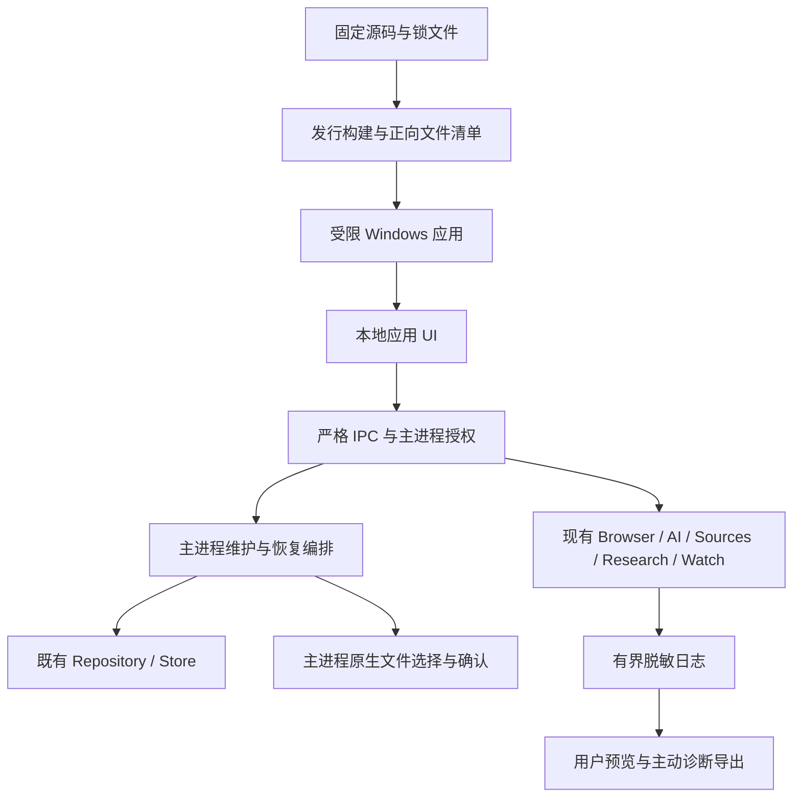

# 第七阶段高层设计

## 1. 基线与能力方向

范围、入口与工程决策见[proposal](proposal.md)。现有Browser、AI/Agent、Sources、Research、Watch依赖方向保持。
以下名称表示计划职责，尚未实现；复用现有模块优先，不为图中每个方框新增通用框架。

远程网页没有应用preload，模型仍只经既有Tool Layer。发行、维护、诊断能力不加入AI工具集。
备份路径、凭据和通用文件句柄不进入renderer；UI只消费经验证DTO和主进程持有的操作句柄。

## 2. 六个风险边界

| 边界           | 责任与接口原则                                                                                                     | 验证位置             |
| -------------- | ------------------------------------------------------------------------------------------------------------------ | -------------------- |
| 发行入口       | dev/qualification与release编译隔离，运行时环境变量不能给release新增能力；固定本地资源来源，验证实际包内内容与fuses | E1、E5               |
| 凭据与外部通信 | Provider端点及其Key授权由main持有；变更目标不能借既有providerId沿用Key。Public/Session/Provider能力仍分离          | E1红队、threat-model |
| 数据维护       | 维护态阻止新写入，排水后生成一致性副本；恢复按可重启清单执行，服务只在验证和协调成功后恢复                         | E2                   |
| 故障恢复       | 网页故障局部化，UI可重建；副作用任务按既有终态/幂等所有权中断，不自动重放用户确认动作                              | E3                   |
| 观测           | 原有日志预算继续生效，补操作关联和受控错误分类；主动导出不等于上传，不收集原始正文                                 | E4                   |
| 交付           | 固定identity/userData、按用户安装、保留数据卸载、手动升级、签名接口与秘密隔离                                      | E5、E6               |

## 3. 数据与生命周期

当前Sources v1、Research v1、Watch v5独立存储；共享迁移引擎是**每版本单独事务**。
第N步失败不撤销此前已提交步骤，恢复设计必须记录准确版本与预升级副本，不能许诺整个升级链自动回滚。
Store恢复状态、业务软删除恢复与用户备份恢复是不同能力，当前尚无全应用恢复入口。

维护操作由main单一所有者串行执行，与正常退出互斥。先关admission，再有界等待/取消在途任务，最后关闭或一致读取数据库。
任何失败都保留原库和已发布备份；跨库恢复需持久化计划与启动检查，不以多个rename伪装原子事务。
恢复后Watch必须重验Source引用并使Session授权失效；不会恢复Cookie、活跃任务或跨重启执行。

同样，崩溃后的页面/UI恢复不能重放Agent L2点击、Research运行或Watch已经消费的slot。
是否恢复Tab列表由现有产品语义决定；本设计不顺带承诺跨重启浏览器会话恢复。

## 4. 构建与交付

E1先形成不含验收入口的目录版候选，E5再通过NSIS安装生命周期。源码、构建、签名和发布各留可追溯清单。
普通构建使用Electron内置node:sqlite；H3b专用native采集器/addon不属于安装包，不能把本任务临时MSVC变成用户运行前置。
需要重新构建资格工具时另核工程范围，不能因设计准备默认重装整个工具链。

未签名内部候选与公开已签名发行状态分开。未取得发布渠道/证书前，可以完成本地包和手工升级验证；
不能伪造签名、偷偷发布或把缺少独立机器的检查记PASS。自动更新本阶段不实现。

## 5. 设计/验证次序

E1 → E2 → E3 → E4 → E5 → E6为默认主线；E2数据与E3恢复风险相关，不并行改同一生命周期所有者。
E1安全、E2持久化/恢复及E6最终阶段门使用独立审核；未改的Stage6证据按具体版本/影响面复用。
测试工具写受控tools，原件/失败/机器配置不入库；每轮真实测量先写对象、预算、停止条件和oracle。

本轮已授权E1–E6实现及必要验收，Stage7完成后停止。下一入口和证据见[progress](../tasks/progress.md)。
